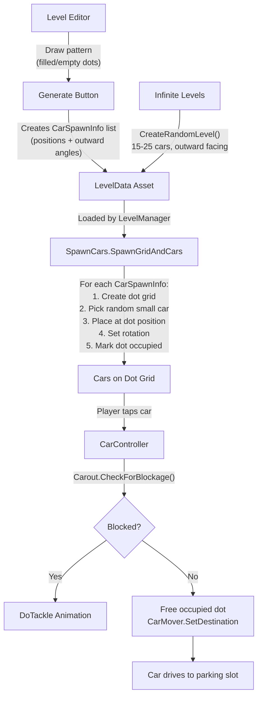

# Dot-Grid System Upgrade — Small Cars Only, Tight Pacing, Fixed Infinite Levels

> [!IMPORTANT]
> This upgrade converts your current **1-cell-per-car box grid** into a **high-resolution dot-grid** for tight pacing. Only **small cars** (1×1 dot) are used. No Medium/Bus sizes. The editor draws a pattern → SpawnCars auto-places all cars. Infinite level generation is fixed to spawn **minimum 15 cars** all facing outward.

---

## What Changes & Why

### Current System (Box Grid)
```
□ □ □ □ □      ← Each □ = one GridSlot = one car
□ □ □ □ □         GridSlotSize = 4.5 units
□ □ □ □ □         Cars are spaced 4.5 units apart = too much gap
```

### New System (Dot Grid)
```
• • • • • • • • • •      ← Each • = one DotSlot
• • • • • • • • • •         DotSize ≈ 2.0 units (calculated from car mesh)
• • • • • • • • • •         Cars occupy 1 dot each
• • • • • • • • • •         Cars nearly touch = tight professional look
• • • • • • • • • •
```

The key change: **more dots in the same physical space → cars packed tighter together**.

---

## Open Questions

> [!IMPORTANT]
> **Q1:** Your current `GridSlotSize` is `4.5f`. Your car prefab scale is approximately `0.7`. Based on this, I'll calculate the new dot spacing as approximately `2.0–2.2` units so cars nearly touch but never overlap. Does that spacing sound right to you, or do you want me to auto-calculate from prefab bounds at runtime?

> [!IMPORTANT]
> **Q2:** Your existing **50 custom levels** (1_Level through 50_Level) all store `CarSpawnInfo` with `gridPosition` coordinates based on the OLD grid size. After this upgrade, those coordinates will map to the NEW dot-grid. The levels will still work but cars will be tighter. **Is that acceptable**, or do you want me to also add a migration tool to re-map old level coordinates?

> [!IMPORTANT]
> **Q3:** For infinite levels, you currently generate `Random.Range(3, 10)` cars. I'll change this to always spawn **minimum 15 cars** all facing outward on a dynamically-sized dot grid. Should the maximum also increase (e.g., 15–25 cars)?

---

## Scripts That WILL Be Modified

| # | Script | Location | Change Scope |
|---|--------|----------|-------------|
| 1 | **LevelData.cs** | [LevelData.cs](file:///c:/Users/ABHAYprajapati/Downloads/Car-OUT-jam-puzzle-Game-CustomeLevelEditor/Car-OUT-jam-puzzle-Game-CustomeLevelEditor/Assets/Script/Level/LevelData.cs) | Remove `CarSize` enum, remove `carSize` from `CarSpawnInfo`, clean up |
| 2 | **SpawnCars.cs** | [SpawnCars.cs](file:///c:/Users/ABHAYprajapati/Downloads/Car-OUT-jam-puzzle-Game-CustomeLevelEditor/Car-OUT-jam-puzzle-Game-CustomeLevelEditor/Assets/Script/SpawnCars.cs) | Replace box grid with dot grid, remove multi-size logic, fix tight spacing, auto-place cars |
| 3 | **LevelEditorWindow.cs** | [LevelEditorWindow.cs](file:///c:/Users/ABHAYprajapati/Downloads/Car-OUT-jam-puzzle-Game-CustomeLevelEditor/Car-OUT-jam-puzzle-Game-CustomeLevelEditor/Assets/Script/Level/Editor/LevelEditorWindow.cs) | Simplify to pattern-only drawing (no size cycling S→M→BUS), editor draws pattern → SpawnCars places cars |
| 4 | **LevelManager.cs** | [LevelManager.cs](file:///c:/Users/ABHAYprajapati/Downloads/Car-OUT-jam-puzzle-Game-CustomeLevelEditor/Car-OUT-jam-puzzle-Game-CustomeLevelEditor/Assets/Script/Level/LevelManager.cs) | Fix `CreateRandomLevel()` to generate min 15 cars with proper dot-grid data |
| 5 | **Carout.cs** | [Carout.cs](file:///c:/Users/ABHAYprajapati/Downloads/Car-OUT-jam-puzzle-Game-CustomeLevelEditor/Car-OUT-jam-puzzle-Game-CustomeLevelEditor/Assets/Script/Carout.cs) | Simplify occupied cells (always 1 cell for small car), keep tackle/blockage working |
| 6 | **CarMover.cs** | [CarMover.cs](file:///c:/Users/ABHAYprajapati/Downloads/Car-OUT-jam-puzzle-Game-CustomeLevelEditor/Car-OUT-jam-puzzle-Game-CustomeLevelEditor/Assets/Script/CarMover.cs) | Remove `CarSize` field, keep all movement/pathing/animation intact |

## Scripts That Will NOT Change

| Script | Reason |
|--------|--------|
| **CarController.cs** | Click detection → Carout.CheckForBlockage → CarMover.SetDestination. No grid changes needed. |
| **ParkingGameManager.cs** | Passenger queue, win/lose, process queue. All independent of grid system. |
| **ParkingSlotManger.cs** | Trigger-based parking detection. Completely independent. |
| **SpawnPassengers.cs** | Spawns passengers based on car colors. Independent of grid. |
| **ObjectPool.cs** | Pool management. Independent of grid. |
| **PowerUps.cs** | Fill slot, rearrange, helicopter. Only uses `SetSlotOccupation()` which still exists. |
| **CarSlotAutoArrange.cs** | Raycast-based. Independent of grid. |

## Things to REMOVE (Dead/Duplicate Code)

> [!WARNING]
> These items currently exist but will become unnecessary after the upgrade:

| Item | Location | Action |
|------|----------|--------|
| `CarSize` enum | [LevelData.cs:16-21](file:///c:/Users/ABHAYprajapati/Downloads/Car-OUT-jam-puzzle-Game-CustomeLevelEditor/Car-OUT-jam-puzzle-Game-CustomeLevelEditor/Assets/Script/Level/LevelData.cs#L16-L21) | **DELETE** — No multi-size cars |
| `carSize` field in `CarSpawnInfo` | [LevelData.cs:28](file:///c:/Users/ABHAYprajapati/Downloads/Car-OUT-jam-puzzle-Game-CustomeLevelEditor/Car-OUT-jam-puzzle-Game-CustomeLevelEditor/Assets/Script/Level/LevelData.cs#L28) | **DELETE** |
| `mediumCarPrefabs`, `busCarPrefabs` lists | [SpawnCars.cs:426-427](file:///c:/Users/ABHAYprajapati/Downloads/Car-OUT-jam-puzzle-Game-CustomeLevelEditor/Car-OUT-jam-puzzle-Game-CustomeLevelEditor/Assets/Script/SpawnCars.cs#L426-L427) | **DELETE** — Only `smallCarPrefabs` kept |
| `GetPrefabForSize()` method | [SpawnCars.cs:802-828](file:///c:/Users/ABHAYprajapati/Downloads/Car-OUT-jam-puzzle-Game-CustomeLevelEditor/Car-OUT-jam-puzzle-Game-CustomeLevelEditor/Assets/Script/SpawnCars.cs#L802-L828) | **DELETE** — replaced with simple random from `smallCarPrefabs` |
| `GetCellsForCar()` method | [SpawnCars.cs:785-800](file:///c:/Users/ABHAYprajapati/Downloads/Car-OUT-jam-puzzle-Game-CustomeLevelEditor/Car-OUT-jam-puzzle-Game-CustomeLevelEditor/Assets/Script/SpawnCars.cs#L785-L800) | **DELETE** — Not needed, each car = 1 cell |
| `cellSizes` array in editor | [LevelEditorWindow.cs:334](file:///c:/Users/ABHAYprajapati/Downloads/Car-OUT-jam-puzzle-Game-CustomeLevelEditor/Car-OUT-jam-puzzle-Game-CustomeLevelEditor/Assets/Script/Level/Editor/LevelEditorWindow.cs#L334) | **DELETE** — No size cycling in editor |
| `CarSize carSize` field on `CarMover` | [CarMover.cs:246](file:///c:/Users/ABHAYprajapati/Downloads/Car-OUT-jam-puzzle-Game-CustomeLevelEditor/Car-OUT-jam-puzzle-Game-CustomeLevelEditor/Assets/Script/CarMover.cs#L246) | **DELETE** |

---

## Proposed Changes — Detailed Per Script

---

### Component 1: LevelData

#### [MODIFY] [LevelData.cs](file:///c:/Users/ABHAYprajapati/Downloads/Car-OUT-jam-puzzle-Game-CustomeLevelEditor/Car-OUT-jam-puzzle-Game-CustomeLevelEditor/Assets/Script/Level/LevelData.cs)

**What changes:**
- Remove `CarSize` enum entirely
- Remove `carSize` field from `CarSpawnInfo`
- Keep `gridPosition` and `rotationY` in `CarSpawnInfo` (these define where and which direction a car faces)
- Keep `gridColumns`, `gridRows`, `carSpawns` list, `carsToSpawn` fallback

**New full code:**
```csharp
using System.Collections.Generic;
using UnityEngine;

[System.Serializable]
public class CarSpawnInfo
{
    public Vector2Int gridPosition; // Coordinates (col, row) on the dot grid
    public float rotationY;         // Facing direction: 0=Up, 90=Right, 180=Down, 270=Left
}

[CreateAssetMenu(fileName = "NewLevel", menuName = "ScriptableObjects/LevelData")]
public class LevelData : ScriptableObject
{
    public int levelNumber;
    
    [Header("Dot Grid Layout")]
    public int gridColumns = 5;
    public int gridRows = 5;
    
    [Header("Spawn Locations")]
    public List<CarSpawnInfo> carSpawns = new List<CarSpawnInfo>();

    [Header("Fallback (Legacy Level Data)")]
    public int carsToSpawn; 
}
```

> [!NOTE]
> Removing `CarSize` enum will cause a compile error in `CarMover.cs` and `SpawnCars.cs` until those are also updated. **All scripts must be updated together.**

---

### Component 2: SpawnCars (The Core Change)

#### [MODIFY] [SpawnCars.cs](file:///c:/Users/ABHAYprajapati/Downloads/Car-OUT-jam-puzzle-Game-CustomeLevelEditor/Car-OUT-jam-puzzle-Game-CustomeLevelEditor/Assets/Script/SpawnCars.cs)

**Summary of changes:**
1. **Replace `GridSlotSize = 4.5f` with `DotSize` (≈2.0f)** — This is what makes cars tight-packed
2. **Remove `mediumCarPrefabs` and `busCarPrefabs`** — Only `smallCarPrefabs` remains
3. **Remove `GetPrefabForSize()`, `GetCellsForCar()`** — Not needed for single-size cars
4. **Update `SpawnGridAndCars()`** — Both editor-level branch and fallback branch use dot grid
5. **Simplify `CheckBlockageForCar()`** — Each car = 1 dot, simpler checks
6. **Keep all existing methods that other scripts depend on:** `GetSlotAt()`, `IsSlotBlocked()`, `SetSlotOccupation()`, `FreeSlots()`, `CheckBlockageForCar()`, `AngleToGridDir()`, `AnimateCarSpawn()`

**New full code:**
```csharp
using System.Collections.Generic;
using UnityEngine;
using System.Linq;
using DG.Tweening;

public class SpawnCars : MonoBehaviour
{
    public static SpawnCars Instance { get; private set; }

    public class GridSlot
    {
        public Vector2Int GridIndex;
        public Vector3 WorldPosition;
        public bool IsOccupied;

        public GridSlot(Vector2Int index, Vector3 pos)
        {
            GridIndex = index;
            WorldPosition = pos;
            IsOccupied = false;
        }
    }

    [Header("Prefabs & References")]
    [SerializeField] public GameObject carSpawnPrefab;

    [Header("Car Prefabs (Small Only)")]
    public List<CarMover> smallCarPrefabs;

    public SpawnPassengers spawnPassengers;
    public LevelData currentLevelData;

    [Header("Dot Grid Layout Settings")]
    public int maxColumns = 5;
    public int maxRows = 5;

    [Tooltip("Spacing between dot centers. Lower = tighter packing. ~2.0 for nearly touching cars.")]
    [SerializeField] private float DotSize = 2.0f;

    [SerializeField] private Vector3 centerArea = new Vector3(-2.4f, 0, -8.5f);

    [Header("Runtime Tracked Positions")]
    public List<GameObject> spawnedPositions = new List<GameObject>();
    
    private List<GridSlot> gridSlots = new List<GridSlot>();

    private void Awake()
    {
        if (Instance == null) Instance = this;
        else Destroy(gameObject);
    }

    // --- GRID ACCESS METHODS (Used by Carout, CarMover, PowerUps, etc.) ---
    public GridSlot GetSlotAt(int x, int y)
    {
        return gridSlots.Find(slot => slot.GridIndex.x == x && slot.GridIndex.y == y);
    }

    public bool IsSlotBlocked(int x, int y)
    {
        GridSlot slot = GetSlotAt(x, y);
        if (slot == null) return false;
        return slot.IsOccupied;
    }

    public void SetSlotOccupation(int x, int y, bool occupied)
    {
        GridSlot slot = GetSlotAt(x, y);
        if (slot != null)
        {
            slot.IsOccupied = occupied;
        }
    }

    public void FreeSlots(List<Vector2Int> cells)
    {
        if (cells == null) return;
        foreach (var cell in cells)
            SetSlotOccupation(cell.x, cell.y, false);
    }

    // --- MAIN ENTRY POINT ---
    public void SpawnCarAsPerLevelNeed()
    {
        SpawnGridAndCars();
    }

    public void SpawnGridAndCars()
    {
        if (currentLevelData == null || carSpawnPrefab == null) return;
        
        ClearOldPositions();
        
        // ═══════════════════════════════════════════════════════
        // BRANCH 1: Editor-designed levels (carSpawns has data)
        // ═══════════════════════════════════════════════════════
        if (currentLevelData.carSpawns != null && currentLevelData.carSpawns.Count > 0)
        {
            maxColumns = currentLevelData.gridColumns;
            maxRows = currentLevelData.gridRows;
            InitializeGridData();

            foreach (var spawn in currentLevelData.carSpawns)
            {
                GridSlot slot = GetSlotAt(spawn.gridPosition.x, spawn.gridPosition.y);
                if (slot == null || slot.IsOccupied) continue;

                Quaternion carRotation = Quaternion.Euler(0, spawn.rotationY, 0);

                // Spawn direction indicator
                GameObject slotIndicator = Instantiate(carSpawnPrefab, slot.WorldPosition, carRotation);
                spawnedPositions.Add(slotIndicator);

                // Pick random small car prefab
                CarMover chosenPrefab = GetRandomSmallPrefab();
                if (chosenPrefab == null) continue;

                CarMover activeCar = ObjectPool.Instance.GetCarFromPool(chosenPrefab);
                
                if (activeCar != null)
                {
                    activeCar.transform.position = slot.WorldPosition;
                    activeCar.transform.rotation = carRotation;
                    activeCar.ResetCapacity();
                    activeCar.ResetEnum();
                    activeCar.gameObject.SetActive(true);
                    activeCar.arrow.enabled = true;
                    activeCar.totalPassengerTxt.enabled = false;
                }
                else
                {
                    activeCar = Instantiate(chosenPrefab, slot.WorldPosition, carRotation);
                    activeCar.originalPrefab = chosenPrefab;
                }

                // Assign grid tracking to Carout
                Carout caroutComp = activeCar.GetComponent<Carout>();
                if (caroutComp != null)
                {
                    caroutComp.currentGridIndex = slot.GridIndex;
                    // Single cell occupancy for small cars
                    caroutComp.SetOccupiedCells(new List<Vector2Int> { slot.GridIndex });
                }
                
                slot.IsOccupied = true;

                AnimateCarSpawn(activeCar, spawnPassengers.TotalCarsSpawn.Count);
                spawnPassengers.TotalCarsSpawn.Add(activeCar);
            }
        }
        // ═══════════════════════════════════════════════════════
        // BRANCH 2: Infinite / Legacy random generation
        // ═══════════════════════════════════════════════════════
        else
        {
            int carsToSpawn = currentLevelData.carsToSpawn;
            if (carsToSpawn <= 0) return;

            // Auto-size the dot grid to fit the requested car count
            // Use a square-ish layout with 1 cell margin on each side for exit paths
            int innerCols = Mathf.CeilToInt(Mathf.Sqrt(carsToSpawn));
            int innerRows = Mathf.CeilToInt((float)carsToSpawn / innerCols);
            maxColumns = innerCols + 2; // +2 for border margin
            maxRows = innerRows + 2;

            InitializeGridData();

            // Collect inner slots only (skip border ring for exit clearance)
            List<GridSlot> innerSlots = new List<GridSlot>();
            for (int r = 1; r < maxRows - 1; r++)
            {
                for (int c = 1; c < maxColumns - 1; c++)
                {
                    GridSlot s = GetSlotAt(c, r);
                    if (s != null) innerSlots.Add(s);
                }
            }

            // Shuffle inner slots for variety
            for (int i = innerSlots.Count - 1; i > 0; i--)
            {
                int j = Random.Range(0, i + 1);
                var temp = innerSlots[i];
                innerSlots[i] = innerSlots[j];
                innerSlots[j] = temp;
            }

            // Calculate center for outward facing
            float sumX = 0, sumY = 0;
            int usableCount = Mathf.Min(carsToSpawn, innerSlots.Count);
            for (int i = 0; i < usableCount; i++)
            {
                sumX += innerSlots[i].GridIndex.x;
                sumY += innerSlots[i].GridIndex.y;
            }
            float cx = sumX / usableCount;
            float cy = sumY / usableCount;

            int spawnedCount = 0;
            for (int i = 0; i < innerSlots.Count && spawnedCount < carsToSpawn; i++)
            {
                GridSlot slot = innerSlots[i];
                if (slot.IsOccupied) continue;

                // Calculate outward-facing direction
                float angle = CalculateOutwardAngle(
                    slot.GridIndex.x, slot.GridIndex.y, cx, cy);
                Quaternion rotation = Quaternion.Euler(0, angle, 0);

                GameObject slotIndicator = Instantiate(carSpawnPrefab, slot.WorldPosition, rotation);
                spawnedPositions.Add(slotIndicator);

                CarMover chosenPrefab = GetRandomSmallPrefab();
                if (chosenPrefab == null) return;
                
                CarMover activeCar = ObjectPool.Instance.GetCarFromPool(chosenPrefab);
                
                if (activeCar != null)
                {
                    activeCar.transform.position = slot.WorldPosition;
                    activeCar.transform.rotation = rotation;
                    activeCar.ResetCapacity();
                    activeCar.ResetEnum();
                    activeCar.gameObject.SetActive(true);
                    activeCar.arrow.enabled = true;
                    activeCar.totalPassengerTxt.enabled = false;
                }
                else
                {
                    activeCar = Instantiate(chosenPrefab, slot.WorldPosition, rotation);
                    activeCar.originalPrefab = chosenPrefab;
                }

                Carout caroutComp = activeCar.GetComponent<Carout>();
                if (caroutComp != null)
                {
                    caroutComp.currentGridIndex = slot.GridIndex;
                    caroutComp.SetOccupiedCells(new List<Vector2Int> { slot.GridIndex });
                }

                AnimateCarSpawn(activeCar, spawnedCount);
                spawnPassengers.TotalCarsSpawn.Add(activeCar);
                slot.IsOccupied = true;
                spawnedCount++;
            }
        }
    }

    // ═══════════════════════════════════════════════════════
    // BLOCKAGE CHECK (8-direction, used by Carout)
    // ═══════════════════════════════════════════════════════
    public bool CheckBlockageForCar(Vector2Int currentGridIndex, Vector3 eulerAngles, out Vector2Int targetGridIndex)
    {
        float angle = Mathf.Repeat(Mathf.Round(eulerAngles.y / 45f) * 45f, 360f);
        int roundedAngle = Mathf.RoundToInt(angle);
        
        Vector2Int stepDir = Vector2Int.zero;
        switch (roundedAngle)
        {
            case 0:   stepDir = new Vector2Int(0, 1);   break;
            case 45:  stepDir = new Vector2Int(1, 1);   break;
            case 90:  stepDir = new Vector2Int(1, 0);   break;
            case 135: stepDir = new Vector2Int(1, -1);  break;
            case 180: stepDir = new Vector2Int(0, -1);  break;
            case 225: stepDir = new Vector2Int(-1, -1); break;
            case 270: stepDir = new Vector2Int(-1, 0);  break;
            case 315: stepDir = new Vector2Int(-1, 1);  break;
        }

        Vector2Int nextCheck = currentGridIndex + stepDir;
        targetGridIndex = currentGridIndex;

        while (true)
        {
            if (IsSlotBlocked(nextCheck.x, nextCheck.y))
            {
                targetGridIndex = nextCheck;
                return true;
            }

            if (GetSlotAt(nextCheck.x, nextCheck.y) == null)
            {
                targetGridIndex = nextCheck - stepDir;
                return false;
            }

            nextCheck += stepDir;
        }
    }

    public Vector2Int AngleToGridDir(float rotationY)
    {
        float angle = Mathf.Repeat(Mathf.Round(rotationY / 45f) * 45f, 360f);

        switch (Mathf.RoundToInt(angle))
        {
            case 0: return new Vector2Int(0, 1);
            case 45: return new Vector2Int(1, 1);
            case 90: return new Vector2Int(1, 0);
            case 135: return new Vector2Int(1, -1);
            case 180: return new Vector2Int(0, -1);
            case 225: return new Vector2Int(-1, -1);
            case 270: return new Vector2Int(-1, 0);
            case 315: return new Vector2Int(-1, 1);
        }

        return Vector2Int.zero;
    }

    // ═══════════════════════════════════════════════════════
    // HELPERS
    // ═══════════════════════════════════════════════════════

    private CarMover GetRandomSmallPrefab()
    {
        if (smallCarPrefabs == null || smallCarPrefabs.Count == 0)
            return null;
        return smallCarPrefabs[Random.Range(0, smallCarPrefabs.Count)];
    }

    private float CalculateOutwardAngle(int x, int y, float cx, float cy)
    {
        float dx = x - cx;
        float dy = y - cy;

        if (Mathf.Abs(dx) < 0.1f && Mathf.Abs(dy) < 0.1f)
        {
            float[] angles = { 0f, 45f, 90f, 135f, 180f, 225f, 270f, 315f };
            return angles[Random.Range(0, angles.Length)];
        }

        float angle = Mathf.Atan2(dx, dy) * Mathf.Rad2Deg;
        if (angle < 0) angle += 360f;
        return Mathf.Round(angle / 45f) * 45f;
    }

    private void InitializeGridData()
    {
        gridSlots.Clear();
        int centerCol = maxColumns / 2;
        int centerRow = maxRows / 2;

        for (int r = 0; r < maxRows; r++)
        {
            for (int c = 0; c < maxColumns; c++)
            {
                float offsetX = (c - centerCol) * DotSize;
                float offsetZ = (r - centerRow) * DotSize;
                Vector3 pos = centerArea + new Vector3(offsetX, 0, offsetZ);
                gridSlots.Add(new GridSlot(new Vector2Int(c, r), pos));
            }
        }
    }

    private void ClearOldPositions()
    {
        foreach (GameObject pos in spawnedPositions)
        {
            if (pos != null) Destroy(pos);
        }
        spawnedPositions.Clear();
        gridSlots.Clear();
    }

    void OnDrawGizmos()
    {
        int centerCol = maxColumns / 2;
        int centerRow = maxRows / 2;
        for (int r = 0; r < maxRows; r++)
        {
            for (int c = 0; c < maxColumns; c++)
            {
                float offsetX = (c - centerCol) * DotSize;
                float offsetZ = (r - centerRow) * DotSize;
                
                if (c == centerCol && r == centerRow) 
                    Gizmos.color = Color.red;
                else 
                    Gizmos.color = Color.cyan;
                
                // Draw small dots instead of big boxes
                Gizmos.DrawWireSphere(
                    centerArea + new Vector3(offsetX, 0, offsetZ), 
                    DotSize * 0.15f);
            }
        }
    }

    private void AnimateCarSpawn(CarMover car, int index)
    {
        if (car == null) return;
        
        Transform t = car.transform;
        Vector3 finalScale = car.GetOriginalScale();

        t.localScale = Vector3.zero;

        Sequence seq = DOTween.Sequence();
        seq.AppendInterval(index * 0.05f);
        seq.Append(
            t.DOScale(finalScale * 1.15f, 0.22f)
            .SetEase(Ease.OutBack)
        );
        seq.Append(
            t.DOScale(finalScale, 0.12f)
            .SetEase(Ease.OutQuad)
        );
    }
}
```

**Key differences from current code:**
- `GridSlotSize = 4.5f` → `DotSize = 2.0f` (tight packing!)
- Removed `mediumCarPrefabs`, `busCarPrefabs`
- Removed `GetPrefabForSize()`, `GetCellsForCar()`
- Infinite/fallback branch now auto-sizes grid to fit car count with border margin
- All cars face outward using `CalculateOutwardAngle()`
- Gizmos draw dots (spheres) instead of boxes

---

### Component 3: LevelEditorWindow

#### [MODIFY] [LevelEditorWindow.cs](file:///c:/Users/ABHAYprajapati/Downloads/Car-OUT-jam-puzzle-Game-CustomeLevelEditor/Car-OUT-jam-puzzle-Game-CustomeLevelEditor/Assets/Script/Level/Editor/LevelEditorWindow.cs)

**What changes:**
- Remove `cellSizes` array entirely (no S/M/BUS cycling)
- Click = toggle cell ON/OFF only (filled or empty)
- Remove the S→M→BUS cycling logic
- Green = filled, Dark = empty (no yellow/red)
- `GenerateSmartLayout()` no longer stores `carSize`
- Button label shows "X" when filled (not "S", "M", "BUS")

**New full code:**
```csharp
#if UNITY_EDITOR
using System.Collections.Generic;
using UnityEngine;
using UnityEditor;

public class LevelEditorWindow : EditorWindow
{
    private LevelData targetLevel;
    private Vector2 scrollPosition;

    // Temporary drawn pattern state
    private bool[,] drawnPattern;
    private int currentCols = 5;
    private int currentRows = 5;
    private bool removeMode = false;

    [MenuItem("Tools/Smart Pattern Editor")]
    public static void ShowWindow()
    {
        GetWindow<LevelEditorWindow>("Smart Pattern Editor");
    }

    private void OnGUI()
    {
        GUILayout.Label("Dot-Grid Pattern Editor", EditorStyles.boldLabel);
        EditorGUILayout.Space();

        // 1. Select LevelData
        EditorGUI.BeginChangeCheck();
        targetLevel = (LevelData)EditorGUILayout.ObjectField(
            "Select Level Data", targetLevel, typeof(LevelData), false);
        if (EditorGUI.EndChangeCheck())
        {
            LoadPatternFromLevel();
        }

        if (targetLevel == null)
        {
            EditorGUILayout.HelpBox("Select a LevelData to begin.", MessageType.Info);
            return;
        }

        EditorGUILayout.BeginVertical("box");
        targetLevel.levelNumber = EditorGUILayout.IntField("Level Number", targetLevel.levelNumber);
        
        // Grid sizing
        EditorGUI.BeginChangeCheck();
        int newCols = EditorGUILayout.IntField("Grid Columns", currentCols);
        int newRows = EditorGUILayout.IntField("Grid Rows", currentRows);
        if (EditorGUI.EndChangeCheck())
        {
            currentCols = Mathf.Clamp(newCols, 3, 20);
            currentRows = Mathf.Clamp(newRows, 3, 20);
            ResizePatternArray();
        }
        EditorGUILayout.EndVertical();
        EditorGUILayout.Space();

        // 2. Draw Pattern Grid
        GUILayout.Label("Draw Puzzle Pattern (Click to place/remove cars):", EditorStyles.boldLabel);
        
        EditorGUILayout.Space();
        removeMode = EditorGUILayout.Toggle("Remove Mode", removeMode);
        EditorGUILayout.Space();
        
        // Quick fill buttons
        EditorGUILayout.BeginHorizontal();
        if (GUILayout.Button("Fill All", GUILayout.Height(25)))
        {
            for (int x = 0; x < currentCols; x++)
                for (int y = 0; y < currentRows; y++)
                    drawnPattern[x, y] = true;
            Repaint();
        }
        if (GUILayout.Button("Clear All", GUILayout.Height(25)))
        {
            drawnPattern = new bool[currentCols, currentRows];
            Repaint();
        }
        EditorGUILayout.EndHorizontal();
        EditorGUILayout.Space();

        scrollPosition = EditorGUILayout.BeginScrollView(scrollPosition);
        
        float buttonSize = 35f;
        EditorGUILayout.BeginVertical();

        if (drawnPattern == null) ResizePatternArray();

        for (int r = currentRows - 1; r >= 0; r--)
        {
            EditorGUILayout.BeginHorizontal();
            GUILayout.FlexibleSpace();
            for (int c = 0; c < currentCols; c++)
            {
                Color originalBg = GUI.backgroundColor;
                bool isFilled = drawnPattern[c, r];

                // Simple two-state coloring
                GUI.backgroundColor = isFilled 
                    ? new Color(0.2f, 0.85f, 0.3f) // Bright green = car slot
                    : new Color(0.15f, 0.15f, 0.15f); // Dark = empty

                string label = isFilled ? "●" : "";

                if (GUILayout.Button(label, GUILayout.Width(buttonSize), GUILayout.Height(buttonSize)))
                {
                    if (removeMode)
                        drawnPattern[c, r] = false;
                    else
                        drawnPattern[c, r] = !isFilled; // Simple toggle
                    
                    Repaint();
                }

                GUI.backgroundColor = originalBg;
            }
            GUILayout.FlexibleSpace();
            EditorGUILayout.EndHorizontal();
        }
        EditorGUILayout.EndVertical();
        EditorGUILayout.EndScrollView();

        EditorGUILayout.Space();
        
        // Count filled cells
        int filledCount = 0;
        if (drawnPattern != null)
        {
            for (int x = 0; x < currentCols; x++)
                for (int y = 0; y < currentRows; y++)
                    if (drawnPattern[x, y]) filledCount++;
        }
        EditorGUILayout.LabelField($"Cars to spawn: {filledCount}", EditorStyles.boldLabel);

        // 3. GENERATE BUTTON
        GUI.backgroundColor = new Color(0.2f, 0.6f, 1f);
        if (GUILayout.Button("GENERATE LEVEL LAYOUT", GUILayout.Height(40)))
        {
            GenerateSmartLayout();
        }

        // 4. SAVE BUTTON
        GUI.backgroundColor = new Color(0.4f, 0.8f, 0.4f);
        if (GUILayout.Button("Save Level Asset", GUILayout.Height(30)))
        {
            EditorUtility.SetDirty(targetLevel);
            AssetDatabase.SaveAssets();
            Debug.Log($"Level_{targetLevel.levelNumber} saved successfully!");
        }
        GUI.backgroundColor = Color.white;
    }

    private void ResizePatternArray()
    {
        bool[,] newPattern = new bool[currentCols, currentRows];

        if (drawnPattern != null)
        {
            int copyCols = Mathf.Min(drawnPattern.GetLength(0), currentCols);
            int copyRows = Mathf.Min(drawnPattern.GetLength(1), currentRows);

            for (int x = 0; x < copyCols; x++)
                for (int y = 0; y < copyRows; y++)
                    newPattern[x, y] = drawnPattern[x, y];
        }

        drawnPattern = newPattern;
    }

    private void LoadPatternFromLevel()
    {
        if (targetLevel == null) return;
        currentCols = targetLevel.gridColumns;
        currentRows = targetLevel.gridRows;
        drawnPattern = new bool[currentCols, currentRows];
        
        foreach (var spawn in targetLevel.carSpawns)
        {
            if (spawn.gridPosition.x < currentCols && spawn.gridPosition.y < currentRows)
            {
                drawnPattern[spawn.gridPosition.x, spawn.gridPosition.y] = true;
            }
        }
    }

    // Auto-generate: Pattern → CarSpawnInfos with outward-facing directions
    private void GenerateSmartLayout()
    {
        targetLevel.gridColumns = currentCols;
        targetLevel.gridRows = currentRows;
        targetLevel.carSpawns.Clear();

        // Find center of drawn pattern
        float sumX = 0, sumY = 0;
        int count = 0;
        
        for (int x = 0; x < currentCols; x++)
        {
            for (int y = 0; y < currentRows; y++)
            {
                if (drawnPattern[x, y])
                {
                    sumX += x;
                    sumY += y;
                    count++;
                }
            }
        }

        if (count == 0) return;

        float centerX = sumX / count;
        float centerY = sumY / count;

        for (int x = 0; x < currentCols; x++)
        {
            for (int y = 0; y < currentRows; y++)
            {
                if (drawnPattern[x, y])
                {
                    float angle = CalculateOutwardDirection(x, y, centerX, centerY);
                    
                    targetLevel.carSpawns.Add(new CarSpawnInfo
                    {
                        gridPosition = new Vector2Int(x, y),
                        rotationY = angle
                    });
                }
            }
        }

        // Also set carsToSpawn for backward compatibility
        targetLevel.carsToSpawn = count;

        EditorUtility.SetDirty(targetLevel);
        Debug.Log($"Generated {count} car placements with outward-facing directions!");
    }

    private float CalculateOutwardDirection(int x, int y, float cx, float cy)
    {
        float dx = x - cx;
        float dy = y - cy;

        if (Mathf.Abs(dx) < 0.1f && Mathf.Abs(dy) < 0.1f)
        {
            float[] angles = { 0f, 45f, 90f, 135f, 180f, 225f, 270f, 315f };
            return angles[UnityEngine.Random.Range(0, angles.Length)];
        }

        float angle = Mathf.Atan2(dx, dy) * Mathf.Rad2Deg;
        if (angle < 0) angle += 360f;
        return Mathf.Round(angle / 45f) * 45f;
    }
}
#endif
```

**Key differences from current editor:**
- No `cellSizes` array, no S/M/BUS cycling
- Simple toggle: click = fill/unfill
- Added "Fill All" / "Clear All" buttons
- Shows car count
- Max grid size increased to 20 (for more dots)
- `GenerateSmartLayout()` does NOT set `carSize` — field no longer exists

---

### Component 4: LevelManager

#### [MODIFY] [LevelManager.cs](file:///c:/Users/ABHAYprajapati/Downloads/Car-OUT-jam-puzzle-Game-CustomeLevelEditor/Car-OUT-jam-puzzle-Game-CustomeLevelEditor/Assets/Script/Level/LevelManager.cs)

**Only the `CreateRandomLevel()` method changes.** Everything else stays exactly the same.

**Current code (broken infinite):**
```csharp
LevelData CreateRandomLevel(int levelNumber)
{
    LevelData level = ScriptableObject.CreateInstance<LevelData>();
    level.levelNumber = levelNumber;
    level.carsToSpawn = Random.Range(3, 10);  // ← TOO FEW, no facing data
    return level;
}
```

**New code:**
```csharp
LevelData CreateRandomLevel(int levelNumber)
{
    LevelData level = ScriptableObject.CreateInstance<LevelData>();
    level.levelNumber = levelNumber;

    // ── FIXED: Minimum 15 cars, max 25, all facing outward ──
    int carsToSpawn = Random.Range(15, 26);
    level.carsToSpawn = carsToSpawn;

    // Generate dot-grid coordinates with outward facing
    int innerCols = Mathf.CeilToInt(Mathf.Sqrt(carsToSpawn));
    int innerRows = Mathf.CeilToInt((float)carsToSpawn / innerCols);
    int totalCols = innerCols + 2;
    int totalRows = innerRows + 2;

    level.gridColumns = totalCols;
    level.gridRows = totalRows;

    // Build list of inner positions and shuffle
    List<Vector2Int> innerPositions = new List<Vector2Int>();
    for (int r = 1; r < totalRows - 1; r++)
        for (int c = 1; c < totalCols - 1; c++)
            innerPositions.Add(new Vector2Int(c, r));

    // Fisher-Yates shuffle
    for (int i = innerPositions.Count - 1; i > 0; i--)
    {
        int j = Random.Range(0, i + 1);
        var tmp = innerPositions[i];
        innerPositions[i] = innerPositions[j];
        innerPositions[j] = tmp;
    }

    // Calculate center for outward direction
    float cx = totalCols / 2f;
    float cy = totalRows / 2f;

    // Create car spawn infos
    level.carSpawns = new List<CarSpawnInfo>();
    for (int i = 0; i < Mathf.Min(carsToSpawn, innerPositions.Count); i++)
    {
        Vector2Int pos = innerPositions[i];
        float dx = pos.x - cx;
        float dy = pos.y - cy;
        float angle;

        if (Mathf.Abs(dx) < 0.1f && Mathf.Abs(dy) < 0.1f)
        {
            float[] angles = { 0f, 45f, 90f, 135f, 180f, 225f, 270f, 315f };
            angle = angles[Random.Range(0, angles.Length)];
        }
        else
        {
            angle = Mathf.Atan2(dx, dy) * Mathf.Rad2Deg;
            if (angle < 0) angle += 360f;
            angle = Mathf.Round(angle / 45f) * 45f;
        }

        level.carSpawns.Add(new CarSpawnInfo
        {
            gridPosition = pos,
            rotationY = angle
        });
    }

    return level;
}
```

**What this fixes:**
- Infinite levels now generate **15–25 cars** (was 3–9)
- Cars have proper `carSpawns` data with grid positions and outward-facing rotations
- This means infinite levels use the **same code path** as editor levels in `SpawnGridAndCars()` — no more falling into the broken legacy fallback

---

### Component 5: Carout

#### [MODIFY] [Carout.cs](file:///c:/Users/ABHAYprajapati/Downloads/Car-OUT-jam-puzzle-Game-CustomeLevelEditor/Car-OUT-jam-puzzle-Game-CustomeLevelEditor/Assets/Script/Carout.cs)

**Minimal changes.** The `CheckForBlockage()` and `DoTackle()` methods stay identical. Only clean up the occupied cells logic since each car = 1 cell.

No code changes needed. The current Carout code already handles:
- `SetOccupiedCells()` — called by SpawnCars with a single-element list
- `CheckForBlockage()` — frees occupied cells, works with any count
- `DoTackle()` — purely animation, no grid logic

**Verdict: No changes required.** ✅

---

### Component 6: CarMover

#### [MODIFY] [CarMover.cs](file:///c:/Users/ABHAYprajapati/Downloads/Car-OUT-jam-puzzle-Game-CustomeLevelEditor/Car-OUT-jam-puzzle-Game-CustomeLevelEditor/Assets/Script/CarMover.cs)

**Only change:** Remove the `CarSize carSize` field (line 246). Everything else stays.

```diff
- [Header("Car Size")]
- public CarSize carSize = CarSize.Small;
```

That's it. All movement, pathing, animation, parking, and drive-away logic stays exactly the same.

---

## Unity Inspector Changes

> [!IMPORTANT]
> After applying all code changes, you need to do these steps in the Unity Inspector:

### On the `SpawnCars` GameObject:
1. The `mediumCarPrefabs` and `busCarPrefabs` fields will **disappear** from the Inspector (they're deleted from code)
2. **`DotSize`** field will appear — set it to `2.0` (or tweak between 1.8–2.5 until cars look tight but don't overlap)
3. **`smallCarPrefabs`** — make sure all your car prefabs are still assigned here

### On Car Prefabs:
1. The `CarSize` dropdown will **disappear** from the Inspector on each CarMover component (it's deleted)
2. No other changes needed on prefabs

### On LevelData Assets:
1. The `carSize` field will disappear from each `CarSpawnInfo` entry
2. Existing levels will still load fine — Unity just ignores the missing serialized field

---

## How It All Flows After The Upgrade



---

## Verification Plan

### Automated Tests
- No unit test framework in project. Verification is manual.

### Manual Verification
1. **Open Unity Editor** → Tools → Smart Pattern Editor
   - Verify only toggle ON/OFF (no S/M/BUS cycling)
   - Draw a pattern, hit GENERATE, save
   - Verify saved LevelData has no `carSize` field

2. **Play Mode — Custom Level**
   - Load any of your 50 existing levels
   - Verify cars spawn with tight packing (nearly touching)
   - Verify cars face outward
   - Click a car → verify blockage check works
   - Click an unblocked car → verify it drives to parking slot
   - Verify passengers board correctly
   - Verify level completes

3. **Play Mode — Infinite Level**
   - Progress past level 50 (or set `currentLevel` to 51 in SaveData)
   - Verify **at least 15 cars** spawn
   - Verify all cars face outward
   - Verify grid auto-sizes to fit all cars
   - Verify gameplay works identically

4. **Play Mode — Power-Ups**
   - Test Fill Slot → verify car on dot grid gets filled
   - Test Rearrange → verify queue reorders
   - Test Helicopter → verify car gets lifted from dot grid, slot freed

5. **Verify NO compile errors** — All scripts must compile together

---

## Summary of What You Need To Do

| Step | Action |
|------|--------|
| 1 | Replace [LevelData.cs](file:///c:/Users/ABHAYprajapati/Downloads/Car-OUT-jam-puzzle-Game-CustomeLevelEditor/Car-OUT-jam-puzzle-Game-CustomeLevelEditor/Assets/Script/Level/LevelData.cs) with the new code above |
| 2 | Replace [SpawnCars.cs](file:///c:/Users/ABHAYprajapati/Downloads/Car-OUT-jam-puzzle-Game-CustomeLevelEditor/Car-OUT-jam-puzzle-Game-CustomeLevelEditor/Assets/Script/SpawnCars.cs) with the new code above (delete all old commented code too) |
| 3 | Replace [LevelEditorWindow.cs](file:///c:/Users/ABHAYprajapati/Downloads/Car-OUT-jam-puzzle-Game-CustomeLevelEditor/Car-OUT-jam-puzzle-Game-CustomeLevelEditor/Assets/Script/Level/Editor/LevelEditorWindow.cs) with the new code above |
| 4 | In [LevelManager.cs](file:///c:/Users/ABHAYprajapati/Downloads/Car-OUT-jam-puzzle-Game-CustomeLevelEditor/Car-OUT-jam-puzzle-Game-CustomeLevelEditor/Assets/Script/Level/LevelManager.cs), replace ONLY the `CreateRandomLevel()` method (lines 546-556) |
| 5 | In [CarMover.cs](file:///c:/Users/ABHAYprajapati/Downloads/Car-OUT-jam-puzzle-Game-CustomeLevelEditor/Car-OUT-jam-puzzle-Game-CustomeLevelEditor/Assets/Script/CarMover.cs), delete lines 244-246 (`CarSize` field) |
| 6 | In Unity Inspector: set `DotSize` to `2.0` on the SpawnCars component |
| 7 | Tweak `DotSize` value (1.8–2.5) until cars look perfectly tight-packed |
| 8 | Test all 5 verification scenarios above |
