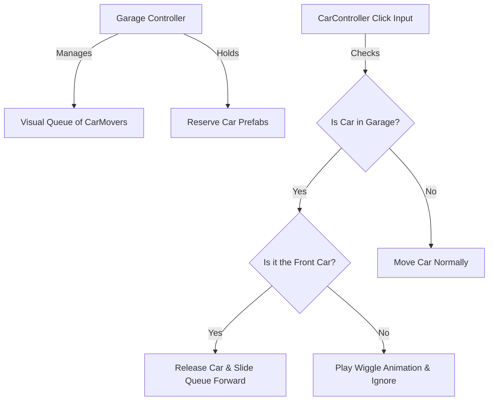

# Garage Prefab System Design

This document details an easy-to-implement, modular **Garage System** that queues up multiple cars inside a garage or driveway prefab. Clicking the garage (or the front car) releases the front vehicle to the parking slots, and all subsequent cars in the queue smoothly slide forward.

---

## System Architecture



---

## 1. New Script: `GarageController.cs`

Create this script under `Assets/Script/GarageController.cs`. It manages the list of cars in the queue, spawns new ones from reserve, and handles the visual shifting.

```csharp
using System.Collections;
using System.Collections.Generic;
using UnityEngine;
using DG.Tweening;

public class GarageController : MonoBehaviour
{
    [Header("Queue Points")]
    [Tooltip("Waypoint transforms inside the garage. Element 0 is the exit/interactable position.")]
    public List<Transform> queuePositions;

    [Header("Car Spawning Reserve")]
    [Tooltip("List of car prefabs that this garage can spawn.")]
    public List<CarMover> carPrefabs;
    [Tooltip("Total number of cars this garage has in reserve (including the ones spawned at start).")]
    public int totalCarsInReserve = 5;

    private List<CarMover> activeQueue = new List<CarMover>();
    private int carsSpawnedCount = 0;

    void Start()
    {
        InitializeGarageQueue();
    }

    /// <summary>
    /// Spawns initial cars to fill all queue slots at start.
    /// </summary>
    private void InitializeGarageQueue()
    {
        if (queuePositions == null || queuePositions.Count == 0 || carPrefabs == null || carPrefabs.Count == 0)
        {
            Debug.LogError("Garage setup is incomplete!", this);
            return;
        }

        // Spawn cars up to the queue capacity or reserve limit
        int spawnCount = Mathf.Min(queuePositions.Count, totalCarsInReserve);
        for (int i = 0; i < spawnCount; i++)
        {
            SpawnCarAtPosition(i);
        }
    }

    /// <summary>
    /// Spawns a random car prefab at a specific queue position index.
    /// </summary>
    private void SpawnCarAtPosition(int index)
    {
        CarMover prefab = carPrefabs[Random.Range(0, carPrefabs.Count)];
        
        // Retrieve from ObjectPool if available, otherwise instantiate
        CarMover newCar = ObjectPool.Instance != null ? ObjectPool.Instance.GetCarFromPool(prefab) : null;
        if (newCar == null)
        {
            newCar = Instantiate(prefab);
        }

        Transform targetPoint = queuePositions[index];
        newCar.transform.position = targetPoint.position;
        newCar.transform.rotation = targetPoint.rotation;
        newCar.ResetCapacity();
        newCar.ResetEnum();
        newCar.gameObject.SetActive(true);

        // Connect the car to this garage owner
        newCar.garageOwner = this;
        
        activeQueue.Add(newCar);
        carsSpawnedCount++;

        // Add to spawner list so win-conditions track it
        if (SpawnCars.Instance != null && SpawnCars.Instance.spawnPassengers != null)
        {
            SpawnCars.Instance.spawnPassengers.TotalCarsSpawn.Add(newCar);
        }
    }

    /// <summary>
    /// Returns true if the clicked car is at the front of this garage's queue.
    /// </summary>
    public bool IsCarFrontOfQueue(CarMover car)
    {
        if (activeQueue.Count == 0) return false;
        return activeQueue[0] == car;
    }

    /// <summary>
    /// Releases the front car, slides all other cars forward, and spawns a replacement if reserve is available.
    /// </summary>
    public void ReleaseFrontCar()
    {
        if (activeQueue.Count == 0) return;

        // 1. Remove the front car from our queue reference
        CarMover releasedCar = activeQueue[0];
        releasedCar.garageOwner = null; // Released car is now independent
        activeQueue.RemoveAt(0);

        // 2. Slide the remaining queue cars forward
        for (int i = 0; i < activeQueue.Count; i++)
        {
            CarMover queueCar = activeQueue[i];
            Transform targetPoint = queuePositions[i];

            // Slide forward smoothly using DOTween
            queueCar.transform.DOKill();
            queueCar.transform.DOMove(targetPoint.position, 0.4f).SetEase(Ease.OutQuad);
            queueCar.transform.DORotateQuaternion(targetPoint.rotation, 0.4f).SetEase(Ease.OutQuad);
        }

        // 3. Spawn a new car at the end of the queue if we have reserves left
        if (carsSpawnedCount < totalCarsInReserve)
        {
            SpawnCarAtPosition(activeQueue.Count);
            
            // Visual entry effect for the newly spawned car: scale up
            CarMover newestCar = activeQueue[activeQueue.Count - 1];
            Vector3 originalScale = newestCar.GetOriginalScale();
            newestCar.transform.localScale = Vector3.zero;
            newestCar.transform.DOScale(originalScale, 0.3f).SetEase(Ease.OutBack);
        }
    }

    /// <summary>
    /// Visual wiggle animation to show the player a car is blocked in the garage queue.
    /// </summary>
    public void PlayBlockedWiggle(CarMover car)
    {
        car.transform.DOKill();
        car.transform.DOShakePosition(0.3f, new Vector3(0.15f, 0f, 0.15f), 10, 90);
    }
}
```

---

## 2. Modifications to Existing Scripts

### [MODIFY] [CarMover.cs](file:///c:/Users/ABHAYprajapati/Downloads/Car-OUT-jam-puzzle-Game-CustomeLevelEditor/Car-OUT-jam-puzzle-Game-CustomeLevelEditor/Assets/Script/CarMover.cs)

Add a variable reference to track if a car is owned by a garage:

```csharp
    [Header("Garage Association")]
    [HideInInspector]
    public GarageController garageOwner; // Will be set when spawned by a garage
```

---

### [MODIFY] [CarController.cs](file:///c:/Users/ABHAYprajapati/Downloads/Car-OUT-jam-puzzle-Game-CustomeLevelEditor/Car-OUT-jam-puzzle-Game-CustomeLevelEditor/Assets/Script/CarController.cs)

Update `HandleCarSelection()` to verify garage queue rules before allowing movement:

```csharp
                CarMover clickedMover = hit.collider.GetComponent<CarMover>();
                if (clickedMover != null && clickedMover.isParked) return;

                // ── GARAGE QUEUE INTERACTION GUARD ──
                if (clickedMover != null && clickedMover.garageOwner != null)
                {
                    if (!clickedMover.garageOwner.IsCarFrontOfQueue(clickedMover))
                    {
                        // Play a jiggle shake animation showing it is blocked
                        clickedMover.garageOwner.PlayBlockedWiggle(clickedMover);
                        return; 
                    }
                }
```

And in the slot reservation block inside `HandleCarSelection()`, release the car from the garage owner when it starts moving:

```csharp
                if (emptySlot != null)
                {
                    CarMover mover = hit.collider.GetComponent<CarMover>();
                    if (mover != null)
                    {
                        // ── RELEASE FROM GARAGE QUEUE ──
                        if (mover.garageOwner != null)
                        {
                            mover.garageOwner.ReleaseFrontCar();
                        }

                        emptySlot.isReserved = true; 
                        emptySlot.incomingCar = mover;
                        mover.isParked = true;
                        
                        mover.SetDestination(emptySlot.transform.position);
                    }
                }
```

---

## Unity Editor Setup Instructions

To build a garage in your scene:

1. **Create Garage Prefab / Container**:
   - Create an empty GameObject in the scene hierarchy named `Garage`.
   - Add a visual mesh representing your garage (e.g. a garage building, driveway arch, or barricades) if desired.
   - Attach the `GarageController` component to the `Garage` GameObject.

2. **Create Queue Waypoints**:
   - Create empty child GameObjects under the `Garage` representing the slot coordinates:
     - `Pos_0` (The exit spot where cars sit to wait for player click).
     - `Pos_1` (Directly behind `Pos_0`).
     - `Pos_2` (Directly behind `Pos_1`).
   - Rotate these waypoints so that `Forward` (Blue Z-axis) points in the direction you want the cars to face.
   - Drag and drop these transforms into the **Queue Positions** list of your `GarageController` in order (Element 0 must be `Pos_0`).

3. **Configure Settings**:
   - Drag your desired car prefabs from your project folder into the **Car Prefabs** list of the `GarageController`.
   - Set **Total Cars In Reserve** (e.g. 5 or 10) to control how many cars can emerge from this garage.
